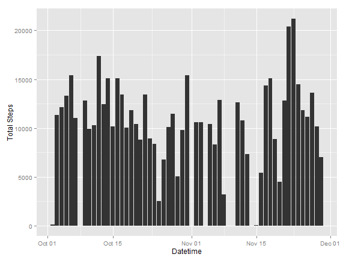
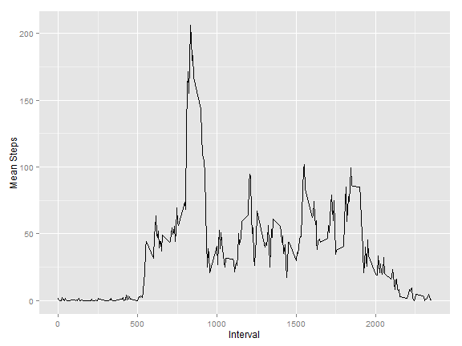
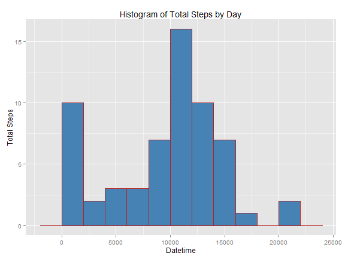
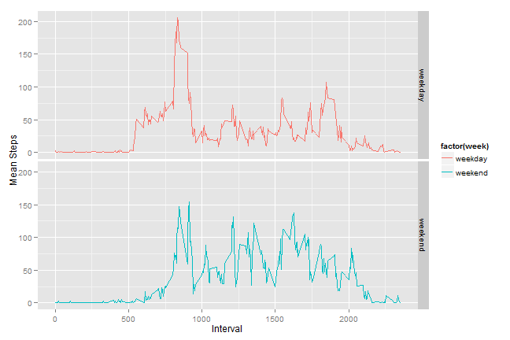

Reproducible Research Peer Assessment 1
========================================================


## Loading and preprocessing the data.

```r
activity <- read.csv(unz("activity.zip", "activity.csv"), header = TRUE)
# Convert the 'date' variable structure from factor to date.
activity$date <- as.Date(activity$date, format = "%Y-%m-%d")
library(plyr)
steps.per.day <- ddply(activity, .(date), function(df) sum(df$steps))
# Rename second column name
colnames(steps.per.day)[2] <- "steps"
```


## What is mean total number of steps taken per day?
Histogram of the total number of steps taken each day.

```r
library(ggplot2)
qplot(steps, data = steps.per.day, xlab = "Datetime", ylab = "Total Steps", 
    binwidth = 2000, main = "Histogram of Total Steps by Day") + geom_histogram(binwidth = 2000, 
    fill = "firebrick", color = "steelblue")
```

 


Calculate the mean of steps taken per day.

```r
mean(steps.per.day$steps, na.rm = TRUE)
```

```
## [1] 10766
```


Calculate the median of steps taken per day.

```r
median(steps.per.day$steps, na.rm = TRUE)
```

```
## [1] 10765
```


## What is the average daily activity pattern?
Time Series plot of mean steps by day

```r
qplot(data = activity, interval, steps, stat = "summary", fun.y = "mean", geom = "line", 
    xlab = "Interval", ylab = "Mean Steps")
```

```
## Warning: Removed 2304 rows containing missing values (stat_summary).
```

 


5-minute interval with the max number of steps across all the averages

```r
max.interval <- ddply(activity, .(date, interval), function(df) mean(df$steps, 
    na.rm = TRUE))
max(max.interval$V1, na.rm = TRUE)
```

```
## [1] 806
```


Total number of missing values in the dataset

```r
sum(is.na(activity))
```

```
## [1] 2304
```


## Imputing missing values
Fill in all of the missing values in the dataset with the mean number of steps that are taken for the coresponding interval that had an NA.

```r
# Find the mean number of steps for each 5 minute interval
mean.interval <- ddply(activity, .(interval), function(df) median(df$steps, 
    na.rm = TRUE))
# Rename second column
colnames(mean.interval)[2] <- "steps"
# Loop to locate and replace NAs
for (i in seq_along(activity$steps)) {
    if (is.na(activity[i, ]$steps)) {
        x <- which(activity[i, ]$interval == mean.interval$interval)
        activity[i, ]$steps <- mean.interval[x, ]$steps
    }
}
```


Histogram of the total number of steps taken each day after NAs were filled.

```r
# Calculate mean steps per day
steps.per.day <- ddply(activity, .(date), function(df) sum(df$steps))
# Rename second column name
colnames(steps.per.day)[2] <- "steps"
qplot(steps, data = steps.per.day, xlab = "Datetime", ylab = "Total Steps", 
    binwidth = 2000, main = "Histogram of Total Steps by Day") + geom_histogram(binwidth = 2000, 
    fill = "steelblue", color = "firebrick")
```

 


Recalculate the sum of steps per day now that NAs are filled in.

```r
steps.per.day <- ddply(activity, .(date), function(df) sum(df$steps, na.rm = TRUE))
# Rename second column name
colnames(steps.per.day)[2] <- "steps"
```


Calculate the mean of steps taken per day.

```r
mean(steps.per.day$steps, na.rm = TRUE)
```

```
## [1] 9504
```


Calculate the median of steps taken per day.

```r
median(steps.per.day$steps, na.rm = TRUE)
```

```
## [1] 10395
```


## Are there differences in activity patterns between weekdays and weekends?
Create a new variable in the dataset with indicating whether a given date is a weekday or weekend day.

```r
activity$week <- ifelse(weekdays(activity$date) %in% c("Saturday", "Sunday"), 
    "weekend", "weekday")

# Convert the variable to a factor format.
activity$week <- as.factor(activity$week)
```


Panel plot containing a time series plot of the 5-minute interval (x-axis) and the average number of steps taken, averaged across all weekday days or weekend days (y-axis).

```r
qplot(data = activity, interval, steps, stat = "summary", fun.y = "mean", geom = "line", 
    xlab = "Interval", ylab = "Mean Steps") + facet_grid(week ~ .) + aes(colour = factor(week))
```

 

